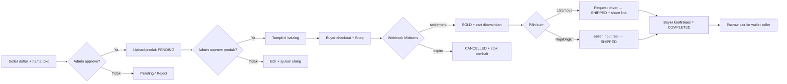

<div align="center">

# ThriftMarket

**Marketplace thrifting / preloved — 1 item = 1 stok tunggal.**

Transparan kondisi (foto defect + ukuran PxL) • Toko dimoderasi admin • Transaksi escrow Midtrans • Pengiriman instant & ekspedisi

[](https://nextjs.org/)
[](https://react.dev/)
[](https://www.typescriptlang.org/)
[](https://www.prisma.io/)
[](https://tailwindcss.com/)
[](https://midtrans.com/)
[](#-lisensi)

[Demo Lokal](#-quickstart-5-menit) • [Akun Demo](#-akun-demo) • [Alur Bisnis](#-alur-bisnis) • [API](#-api)

</div>

---

## Kenapa ThriftMarket?

| Masalah thrifting biasa | Solusi ThriftMarket |
|---|---|
| Foto menyembunyikan cacat | Foto defect **wajib** + badge kondisi + ukuran PxL cm |
| Stok ganda / rebutan | **1 item = 1 stok**, lock atomik anti double-booking |
| Takut ketipu | Dana ditahan **escrow**, cair setelah barang diterima |
| Toko abal-abal | Seller + toko + tiap produk **di-approve admin** |
| Login campur aduk | **3 pintu terpisah**: Buyer / Seller Center / Admin panel |
| Ongkir tidak transparan | Pilihan **Lalamove (instant)** atau **RajaOngkir (ekspedisi)** per toko |

## Showcase

| Area | Tampilan | Rute |
|---|---|---|
| Landing (Metronic SaaS) | Hero, brand strip, how-it-works, pricing, FAQ | `/` |
| Katalog buyer | Filter harga / kondisi / PxL, badge, dark mode | `/products` |
| Detail produk | Galeri + foto defect, info toko, review | `/products/[id]` |
| Wishlist & follow toko | Simpan produk, ikuti toko favorit | `/wishlist`, `/chat` |
| Chat buyer ↔ seller | Percakapan per toko/pesanan + notifikasi | `/chat` |
| Seller Center | Overview, inventori, bulk edit, resi, wallet, analytics | `/seller` |
| Admin panel | Sellers, products, orders, users, disputes, payouts, promos | `/admin` |
| AI Chatbot | Asisten katalog (Groq), reset riwayat tiap sesi | widget kanan-bawah |

> Ganti dengan screenshot asli: `docs/landing.png`, `docs/catalog.png`, `docs/seller.png`, `docs/admin.png`

## Tech Stack

```
Next.js 15 (App Router) • React 19 • TypeScript strict
Tailwind CSS + Lucide Icons      TanStack Query + Zustand
MySQL + Prisma ORM               Auth.js (Credentials + Google)
Cloudinary (upload)              Midtrans Snap Sandbox (escrow)
Lalamove API (instant)           RajaOngkir API (ekspedisi)
Groq (AI chat katalog)
```

## Fitur Unggulan

### Marketplace inti
- **Triple login** — `/login` (buyer + Google), `/seller/login`, `/admin/login` (credentials only)
- **Seller approval** — register + nama toko custom → PENDING → admin approve di `/admin/sellers`
- **Moderasi produk** — produk baru PENDING (tak tampil di katalog); reject bisa edit + ajukan ulang
- **Checkout atomik** — guard `updateMany` + validasi alamat milik sendiri + Snap expiry 24 jam
- **Escrow** — webhook SHA-512 Midtrans, dana cair ke wallet seller setelah buyer konfirmasi
- **Multi-merchant** — 1 pembayaran, N pesanan terpisah per toko (subtotal + ongkir dihitung per toko)

### Pengiriman
- **Lalamove (instant/sameday)** — quote on-demand pakai koordinat pickup seller & alamat buyer, order otomatis, share link tracking
- **RajaOngkir (ekspedisi)** — JNE / JNT / SiCepat berbasis berat & kota, cek resi
- **Koordinat alamat** — lat/lng + No. HP di form alamat, tombol "Gunakan lokasi saya"
- **Shipment timeline** — `ShipmentEvent` mencatat tiap perubahan status pengiriman

### Buyer & seller
- Modal keranjang, modal tambah alamat, riwayat pesanan, dark mode global
- **Wallet seller** — saldo, ledger, pengajuan withdraw (`/seller/wallet`)
- **Analytics seller** — omzet, ongkir, fee platform (`/seller/analytics`)
- **Bulk manage produk** — edit/hapus massal (`/seller/products/bulk`)
- **Dispute/refund** — sengketa pesanan ditangani admin (`/seller/disputes`)
- **Chat & notifikasi** — percakapan langsung + notifikasi in-app
- **Review** — rating bintang + komentar, moderasi admin
- **AI chatbot** — cari katalog & FAQ via Groq, **riwayat di-reset setiap sesi**

### Admin
- Dashboard statistik, activity log seller, kelola seller/users/promos/kategori/reviews
- Moderasi produk & orders, dispute resolution, approve payout seller
- Auto-complete pesanan via cron (`/api/cron/auto-complete`)

## Alur Bisnis



## Quickstart (5 menit)

```bash
npm install
cp .env.example .env     # isi kredensial di bawah
npx prisma db push
npm run db:seed
npm run dev              # http://localhost:3000
```

> PowerShell Restricted? Pakai `npm.cmd` / `npx.cmd` (mis. `npm.cmd run dev`).

<details>
<summary><b>Environment variables</b></summary>

| Key | Contoh / Catatan |
|---|---|
| `DATABASE_URL` | `mysql://root:@localhost:3306/thriftmarket` |
| `AUTH_SECRET` | random min 32 char |
| `AUTH_GOOGLE_ID` / `AUTH_GOOGLE_SECRET` | OAuth buyer (opsional) |
| `NEXT_PUBLIC_APP_URL` | `http://localhost:3000` |
| `CLOUDINARY_CLOUD_NAME` / `API_KEY` / `API_SECRET` | upload foto (kosong = 503 jelas) |
| `MIDTRANS_SERVER_KEY` / `MIDTRANS_CLIENT_KEY` / `NEXT_PUBLIC_MIDTRANS_CLIENT_KEY` | sandbox `SB-Mid-*` |
| `CRON_SECRET` | proteksi endpoint cron |
| `GROQ_API_KEY` / `GROQ_MODEL` | AI chatbot (kosong = fitur chat fallback) |
| `LALAMOVE_KEY` / `LALAMOVE_SECRET` / `LALAMOVE_MARKET` | market `ID` (kosong = tombol Lalamove disembunyikan) |
| `RAJAONGKIR_KEY` | API key RajaOngkir (kosong = fallback tarif dummy) |

</details>

## Akun Demo

Password semua: **`password123`** (jalankan `npm run db:seed` dulu)

| Role | Email | Masuk di |
|---|---|---|
| Buyer | `buyer@thrift.test` | `/login` |
| Seller (APPROVED) | `seller@thrift.test` | `/seller/login` |
| Admin | `admin@thrift.test` | `/admin/login` |

Seller baru daftar di `/seller/register` → cek `/seller/pending` → approve di `/admin/sellers`.

## API

<details>
<summary><b>Lihat tabel endpoint</b></summary>

**Auth & akun**

| Endpoint | Akses | Fungsi |
|---|---|---|
| `POST /api/auth/register` | publik | buyer aktif langsung; seller transaksional PENDING |
| `GET/POST/PATCH/DELETE /api/addresses` | buyer | CRUD alamat + lat/lng + no. HP (Lalamove) |

**Produk & katalog**

| Endpoint | Akses | Fungsi |
|---|---|---|
| `GET/POST /api/products` | publik / seller+ | katalog `AVAILABLE+APPROVED`; seller buat PENDING |
| `PATCH /api/products/[id]` | seller | edit milik sendiri; `resubmit:true` untuk REJECTED |
| `GET /api/products/related` / `categories` | publik | rekomendasi & kategori |
| `POST /api/seller/products/bulk` | seller | edit/hapus produk massal |

**Keranjang, wishlist, follow**

| Endpoint | Akses | Fungsi |
|---|---|---|
| `POST/GET/DELETE /api/cart` | buyer | tolak SOLD / non-approved / self-buy; auto-cleanup |
| `POST/GET/DELETE /api/wishlist` | buyer | simpan produk favorit |
| `POST/GET/DELETE /api/follows` | buyer | ikuti toko |

**Checkout, order, pengiriman**

| Endpoint | Akses | Fungsi |
|---|---|---|
| `POST /api/checkout` | buyer | lock stok atomik + alamat milik sendiri |
| `POST /api/checkout/preview` | buyer | quote ongkir per toko (Lalamove + RajaOngkir) |
| `GET /api/shipping` | publik | tarif kurir fallback berbasis kota |
| `GET /api/orders` | buyer | tanpa param = riwayat; `orderNumber` = detail (ownership) |
| `POST /api/orders` | webhook | verifikasi signature Midtrans |
| `POST /api/orders/confirm` | buyer | SHIPPED → COMPLETED + cairkan escrow |
| `GET/PATCH /api/seller/orders` | seller | pesanan toko + resi (hanya PAID) |

**Interaksi**

| Endpoint | Akses | Fungsi |
|---|---|---|
| `GET/POST /api/messages` | buyer+seller | chat per toko/pesanan |
| `GET/PATCH /api/notifications` | user | notifikasi in-app |
| `POST /api/ai-chat` | publik | asisten katalog Groq |
| `GET/POST /api/reviews` | buyer | review setelah transaksi |
| `GET/POST /api/disputes` | buyer | ajukan sengketa |

**Seller center**

| Endpoint | Akses | Fungsi |
|---|---|---|
| `GET /api/seller/status` | seller | status approval sendiri |
| `GET/PATCH /api/seller/store` | seller | kelola info toko |
| `GET /api/seller/analytics` | seller | omzet + fee platform |
| `GET/POST /api/seller/wallet` | seller | saldo + pengajuan withdraw |

**Admin**

| Endpoint | Akses | Fungsi |
|---|---|---|
| `GET/PATCH/DELETE /api/admin/products` | admin | moderasi produk |
| `GET/PATCH /api/admin/sellers` / `[id]` | admin | moderasi seller + suspend |
| `GET/PATCH /api/admin/orders` | admin | moderasi pesanan + resi |
| `GET/PATCH /api/admin/users` | admin | kelola user |
| `GET/PATCH /api/admin/disputes` | admin | resolusi sengketa |
| `GET/PATCH /api/admin/payouts` | admin | approve withdraw seller |
| `GET/PATCH/DELETE /api/admin/promos` | admin | kelola kode promo |
| `GET/PATCH/DELETE /api/admin/reviews` | admin | sembunyikan ulasan |
| `GET/PATCH /api/admin/settings` | admin | site name, ongkir flat, fee % |
| `GET /api/admin/stats` / `activity` | admin | statistik & audit log |
| `GET /api/cron/auto-complete` | cron | auto-complete pesanan lama |

</details>

## Scripts

| Perintah | Fungsi |
|---|---|
| `npm run dev` | dev server |
| `npm run build` / `start` | production |
| `npm run typecheck` | `tsc --noEmit` (wajib hijau) |
| `npm run lint` | ESLint Next.js |
| `npm run db:push` / `db:seed` | sync schema + data demo |

## Struktur

```
app/  page.tsx  login/  products/  cart/  checkout/  orders/  addresses/
      wishlist/  chat/
      seller/{login,register,pending,(panel)/{analytics,disputes,products/bulk,wallet}}/
      admin/{login,(panel)/{sellers,products,orders,users,disputes,payouts,promos,settings}}/
      api/{auth,products,cart,wishlist,follows,checkout,orders,shipping,
           reviews,addresses,upload,messages,notifications,disputes,
           ai-chat,cron,seller,admin}/
prisma/  schema.prisma  seed.ts
lib/  auth.ts  shipping.ts  lalamove.ts  wallet.ts  notify.ts
      seller.ts  admin.ts  activity.ts  validators.ts  rate-limit.ts
components/  navbar.tsx  ai-chat.tsx  address-form.tsx  extras.tsx
      admin/shell.tsx  seller/shell.tsx
```

## Roadmap

- [x] Cron auto-complete 1x24 jam
- [x] Dispute / refund flow buyer
- [x] Multi-merchant checkout
- [x] Wallet + payout seller
- [ ] Webhook Lalamove otomatis (status real-time)
- [ ] Integrasi RajaOngkir live (province/city/subdistrict API)
- [ ] Peta pin-drop di form alamat
- [ ] Notifikasi WhatsApp / email

## Batasan Saat Ini

Integrasi Lalamove & RajaOngkir berjalan dalam mode sandbox/mock (aktif penuh setelah API key diisi). Auto-complete mengandalkan cron eksternal. Kredensial demo di halaman login hanya untuk development.

## Kontribusi

PR & issue dipersilakan. Pastikan `npm run typecheck` hijau dan jelaskan langkah reproduksi untuk bug.

## Lisensi

MIT — bebas dipakai & dimodifikasi. Tema terinspirasi Metronic SaaS / Demo 6 oleh KeenThemes.
