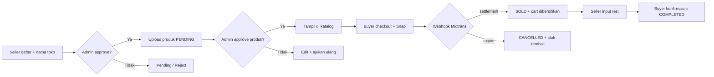

<div align="center">

# ThriftMarket

**Marketplace thrifting / preloved — 1 item = 1 stok tunggal.**

Transparan kondisi (foto defect + ukuran PxL) • Toko dimoderasi admin • Transaksi escrow Midtrans

[](https://nextjs.org/)
[](https://react.dev/)
[](https://www.typescriptlang.org/)
[](https://www.prisma.io/)
[](https://tailwindcss.com/)
[](https://midtrans.com/)
[](./LICENSE)

[Demo Lokal](#-quickstart-5-menit) • [Akun Demo](#-akun-demo) • [Alur Bisnis](#-alur-bisnis) • [API](#-api)

</div>

---

## Kenapa ThriftMarket?

| Masalah thrifting biasa | Solusi ThriftMarket |
|---|---|
| Foto menyembunyikan cacat | Foto defect **wajib** + badge kondisi + ukuran PxL cm |
| Stok ganda / rebutan | **1 item = 1 stok**, lock atomik anti double-booking |
| Takut ketipu | Dana ditahan **escrow**, cair setelah barang diterima |
| Toko abal-abal | Seller + toko + tiap produk **di-approve admin** |
| Login campur aduk | **3 pintu terpisah**: Buyer / Seller Center / Admin panel |

## Showcase

| Area | Tampilan | Rute |
|---|---|---|
| Landing (Metronic SaaS) | Hero, brand strip, how-it-works, pricing, FAQ | `/` |
| Katalog buyer | Filter harga / kondisi / PxL, badge, dark mode | `/products` |
| Seller Center | Overview, inventori, resi, ulasan (terbatas) | `/seller` |
| Admin panel (Demo 6) | Sellers, products, orders, users, dark mode | `/admin` |

> Ganti dengan screenshot asli: `docs/landing.png`, `docs/catalog.png`, `docs/seller.png`, `docs/admin.png`

## Tech Stack

```
Next.js 15 (App Router) • React 19 • TypeScript strict
Tailwind CSS + Lucide Icons      TanStack Query + Zustand
MySQL + Prisma ORM               Auth.js (Credentials + Google)
Cloudinary (upload)              Midtrans Snap Sandbox (escrow)
```

## Fitur Unggulan

- **Triple login** — `/login` (buyer + Google), `/seller/login`, `/admin/login` (credentials only)
- **Seller approval** — register + nama toko custom → PENDING → admin approve di `/admin/sellers`
- **Moderasi produk** — produk baru PENDING (tak tampil di katalog); reject bisa edit + ajukan ulang
- **Checkout atomik** — guard `updateMany` + validasi alamat milik sendiri + Snap expiry 24 jam
- **Webhook aman** — verifikasi signature SHA-512 Midtrans, transisi PAID/SOLD & CANCELLED/AVAILABLE
- **Buyer UX** — modal keranjang, modal tambah alamat, dropdown profil, riwayat pesanan, dark mode global
- **QA-hardened** — 9 test-case dieksekusi (race condition, IDOR, upload, review duplikat)

## Alur Bisnis



## Quickstart (5 menit)

```bash
npm install
cp .env.example .env     # isi kredensial di bawah
npx prisma db push
npm run db:seed
npm run dev              # http://localhost:3000
```

> PowerShell Restricted? Pakai `npm.cmd` / `npx.cmd` (mis. `npm.cmd run dev`).

<details>
<summary><b>Environment variables</b></summary>

| Key | Contoh |
|---|---|
| `DATABASE_URL` | `mysql://root:@localhost:3306/thriftmarket` |
| `AUTH_SECRET` | random min 32 char |
| `AUTH_GOOGLE_ID` / `AUTH_GOOGLE_SECRET` | OAuth buyer (opsional) |
| `NEXT_PUBLIC_APP_URL` | `http://localhost:3000` |
| `CLOUDINARY_CLOUD_NAME` / `API_KEY` / `API_SECRET` | upload foto (kosong = 503 jelas) |
| `MIDTRANS_SERVER_KEY` / `MIDTRANS_CLIENT_KEY` / `NEXT_PUBLIC_MIDTRANS_CLIENT_KEY` | sandbox `SB-Mid-*` |

</details>

## Akun Demo

Password semua: **`password123`** (jalankan `npm run db:seed` dulu)

| Role | Email | Masuk di |
|---|---|---|
| Buyer | `buyer@thrift.test` | `/login` |
| Seller (APPROVED) | `seller@thrift.test` | `/seller/login` |
| Admin | `admin@thrift.test` | `/admin/login` |

Seller baru daftar di `/seller/register` → cek `/seller/pending` → approve di `/admin/sellers`.

## API

<details>
<summary><b>Lihat tabel endpoint</b></summary>

| Endpoint | Akses | Fungsi |
|---|---|---|
| `POST /api/auth/register` | publik | buyer aktif langsung; seller transaksional PENDING |
| `GET/POST /api/products` | publik / seller+ | katalog `AVAILABLE+APPROVED`; seller buat PENDING |
| `PATCH /api/products/[id]` | seller | edit milik sendiri; `resubmit:true` untuk REJECTED |
| `POST/GET/DELETE /api/cart` | buyer | tolak SOLD / non-approved / self-buy; auto-cleanup |
| `POST /api/checkout` | buyer | lock stok atomik + alamat milik sendiri |
| `GET /api/orders` | buyer | tanpa param = riwayat; dengan `orderNumber` = detail (ownership) |
| `POST /api/orders` | webhook | verifikasi signature Midtrans |
| `POST /api/orders/confirm` | buyer | SHIPPED → COMPLETED (idempoten) |
| `GET/PATCH /api/seller/orders` | seller | pesanan toko + resi (hanya PAID) |
| `GET /api/seller/status` | seller | status approval sendiri |
| `GET/PATCH /api/admin/sellers` | admin | moderasi seller + store atomik |
| `GET/PATCH/DELETE /api/admin/products` | admin | moderasi produk |

</details>

## Scripts

| Perintah | Fungsi |
|---|---|
| `npm run dev` | dev server |
| `npm run build` / `start` | production |
| `npm run typecheck` | `tsc --noEmit` (wajib hijau) |
| `npm run db:push` / `db:seed` | sync schema + data demo |

## Struktur

```
app/  page.tsx  login/  products/  cart/  checkout/  orders/  addresses/
      seller/{login,register,pending,(panel)}/
      admin/{login,(panel)}/
      api/{auth,products,cart,checkout,orders,reviews,addresses,upload,seller,admin}/
prisma/  schema.prisma  seed.ts
lib/  auth.ts  seller.ts  admin.ts  validators.ts
components/  navbar.tsx  admin/shell.tsx  seller/shell.tsx
```

## Roadmap

- [ ] Cron auto-complete 1x24 jam
- [ ] Dispute / refund flow buyer
- [ ] Rate-limit + audit log admin
- [ ] Multi-merchant checkout
- [ ] Upload logo toko via Cloudinary

## Batasan Saat Ini

Auto-complete masih teks panduan (konfirmasi manual), nama toko boleh duplikat (moderasi manual), kredensial demo di halaman login hanya untuk development.

## Kontribusi

PR & issue dipersilakan. Pastikan `npm run typecheck` hijau dan jelaskan langkah reproduksi untuk bug.

## Lisensi

MIT — bebas dipakai & dimodifikasi. Tema terinspirasi Metronic SaaS / Demo 6 oleh KeenThemes.
